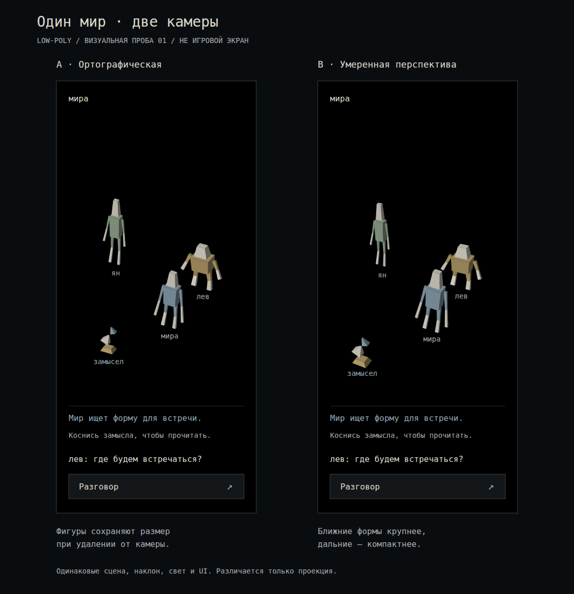

# Визуальный язык и интерфейс живого мира

Дата: 2026-09-06. Статус: рабочее визуальное описание для обсуждения.

Вход в контекст — [продуктовый план](evolving-world-product-plan.md). Последовательность игры — [первая сессия](evolving-world-first-session.md). Здесь собраны художественные правила, композиция экранов и требования к создаваемым формам. Это план будущей версии; схемы ниже не являются изображениями работающей игры.

## Поддержано пользователем

- Новое направление — low-poly 3D с эстетическим ориентиром на игры TempleOS и более спокойными цветами.
- Текущий визуальный облик игры не удовлетворяет пользователя; его не нужно сохранять в новом замысле.
- Телефон — основная платформа, другие устройства участвуют в том же мире.
- Начальная сцена почти пуста: чёрное пространство, персонажи, движение и общение.
- Персонажи, объекты и элементы мира должны допускать генеративное создание вариаций без обязательного сервиса рисования изображений или ручного изготовления каждого ассета в Blender.
- Сейчас продолжаем тщательно планировать и сохранять контекст в Markdown для других агентов. Разработку игры и выпуск изменений в этой сессии не начинаем.

Все конкретные цвета, пропорции, жесты и композиционные решения далее — предложения. Их нельзя автоматически считать отдельно утверждёнными требованиями.

## Художественное направление

Рабочий образ: небольшие странные объёмные существа в спокойной чёрной пустоте. Отдельные формы появляются, приобретают значение и оставляют память. История постепенно становится видимой географией.

Выразительность строится на силуэте, крупных гранях, пропорциях, цветовых пятнах и движении. Основные поверхности однотонные; форма читается по разнице освещённости граней. Текстуры и сложные эффекты не являются основой узнаваемости.

TempleOS — референс визуального языка. Его технические ограничения не назначаются требованиям браузерной игры. Исторический принцип трёхмерных форм из треугольников описан в [авторском FAQ](https://tinkeros.github.io/WbTempleOS/Doc/FAQ.html). Наши палитра, композиция и устройство интерфейса разрабатываются отдельно.

Желаемая странность — в асимметрии, необычных пропорциях и сочетании простых форм. Детали должны оставаться различимыми на телефоне. Пустота, спокойные участки и редкие акценты сохраняют значение по мере накопления объектов.

## Палитра-кандидат

| Роль | Цвет | Предлагаемое значение |
|---|---|---|
| Пустота | Чёрный | `#000000` |
| Поверхность чтения | Очень тёмный нейтральный | `#14171A` |
| Основной текст и светлая геометрия | Костяной | `#DDD9CC` |
| Вторичный текст | Светлый серый | `#A9ADB2` |
| Акцент | Серо-голубой | `#91A9B8` |
| Дополнительная геометрия | Шалфейный | `#9BAF96` |
| Дополнительная геометрия | Тусклая охра | `#BEA56F` |
| Дополнительная геометрия | Пыльный лиловый | `#AEA0BB` |

Не нужно одновременно использовать все акценты в каждом объекте. У персонажа предлагаем основной тон и один узнаваемый акцент. Состояние подготовки сообщается также текстом и формой; один цвет не несёт всю информацию. Итоговую читаемость нужно оценить на экранах телефонов.

## Камера, пространство и масштаб

Первый кандидат — устойчивый вид немного сверху с умеренной перспективой. Свой персонаж остаётся хорошо виден; основной опыт не требует постоянного вращения камеры. Разница между ортографическим видом и перспективой остаётся предметом визуального сравнения до реализации.

В пустоте краткий указатель точки назначения и движение собственного персонажа дают обратную связь. Постоянная сетка, сплошная видимая земля и готовые здания не назначаются содержанием начальной сцены.

Размеры соотносятся с фигурой игрока: небольшой артефакт, объект для взаимодействия, заметный ориентир. Даже маленький артефакт должен быть удобно выбрать касанием; точное попадание в узкую грань не требуется. Выбор объекта и перемещение в свободную область должны быть различимы.

## Персонажи и вариации

Вариации могут менять высоту, ширину, форму головы, длину и расположение конечностей, осанку, акцент и манеру движения. У персонажа сохраняются узнаваемый силуэт и устойчивое основание, относительно которого понятны его положение и направление движения.

Для первого визуального сравнения предлагаем несколько выразительно разных фигур: высокую тонкую, низкую широкую и наклонённую с длинными руками. Это образцы для оценки диапазона, не готовые классы или роли.

Индивидуальность дополняют простые движения частей: шаг, поворот, лёгкое покачивание. Выразительная анимация не требует заранее отрисованных направлений. Внешность сохраняется между посещениями и одинаково узнаётся другими участниками; способ выбора и изменения облика пока не определён.

## Объекты, предвестники и память

| Состояние | Возможный облик | Что должно быть понятно |
|---|---|---|
| Выбранный замысел готовится | Неполная форма из нескольких граней | Здесь идёт подтверждённая подготовка; касанием можно прочитать её смысл. |
| Изменение стало доступно | Собранная форма, короткое событие появления | Новую возможность можно попробовать; доступна история происхождения. |
| Подготовка задержалась | Узнаваемая незавершённая форма без имитации продвижения | Работа задержана; возможность ещё не существует. |
| Действовавшая механика отменена | Сохранившийся артефакт с изменённой деталью или движением | История доступна, прежнее действие больше не работает. |

Графический приём не должен изображать готовность по выдуманному таймеру. Объекты старых изменений остаются заметными и читаемыми. Короткое появление можно пропустить без потери доступа к результату.

Генерация элементов мира подчиняется возникающей истории. Ландшафты и здания могут появиться позднее, если это станет содержанием изменения; заполнять ими пустоту перед первым разговором не требуется.

## Создание форм без обязательного редактора ассетов

Основной предлагаемый подход — воспроизводимое описание геометрии: силуэт, части, их размеры и расположение, цвета, движение и масштаб относительно персонажа. На его основе строится объёмный объект.

Такое описание должно позволять как вариации знакомой формы, так и новую геометрию. Набор кубов и конусов не объявляется пределом творческой свободы. При этом первый генератор не обязан уметь создавать всё: сначала нужен небольшой выразительный диапазон и возможность расширять его по конкретным игровым идеям.

Обязательные свойства будущего подхода:

- Воспроизводимость: один и тот же объект сохраняет облик между посещениями и для разных игроков.
- Общий художественный язык: ограниченная детализация, согласованные пропорции и палитра.
- Управляемая сложность: вариация не должна бесконтрольно увеличивать количество частей и движений.
- Независимость от обязательной ручной обработки каждой модели и генерации растровой картинки.
- Различие внешности и механики: необычная геометрия сама по себе не создаёт игровое действие; поведение определяет соответствующее изменение.

Не выбраны движок, библиотека, формат описания, способ участия ИИ и конкретный алгоритм создания геометрии. Пользователь отвергает обязательную зависимость от определённого инструмента изготовления графики, а не саму возможность использовать вспомогательные инструменты когда-либо.

## Интерфейс телефона

Мир занимает основную часть экрана. Постоянных элементов немного: своё имя, краткие сообщения и действие «Разговор». Сведения о подготовке появляются только при реальной активной работе. Начальная сцена не содержит индикаторов здоровья, валюты, инвентаря или ряда способностей, которых ещё нет.

Подписи предлагаем короткие и ровные, с моноширинным характером. Длинная история должна свободно переноситься и прокручиваться. Рабочие ориентиры для будущего макета: основной текст порядка 16–18 пикселей, области касания порядка 44–48 пикселей. Это предлагаемые размеры для проверки; конкретный шрифт и окончательные значения не выбраны.

Тёмная поверхность чтения, тонкое разделение областей и один акцент помогают сохранить внимание на мире. Значимые действия имеют текстовые названия. Нижние элементы учитывают системную область жестов и экранную клавиатуру.

### Прогулка

```text
┌──────────────────────────┐
│ имя                      │
│                          │
│     другой игрок         │
│                          │
│             своя фигура  │
│                          │
│    предвестник            │
│                          │
│ имя: короткое сообщение  │
│ [Разговор]               │
└──────────────────────────┘
```

Подписи фигур на схеме обозначают их место, а не обязательный текст над каждым объектом. Предвестник появляется только после выбора изменения в работу. Первоначально его нет.

### Разговор во время набора

```text
┌──────────────────────────┐
│   видимая часть мира     │
├──────────────────────────┤
│ Разговор       [Закрыть] │
│ имя: сообщение           │
│ имя: ответ               │
│ [Сообщение…] [Отправить] │
├──────────────────────────┤
│    экранная клавиатура   │
└──────────────────────────┘
```

Беседа сохраняет черновик при переключении внутри игры. При её открытии своё движение останавливается. Другие участники продолжают играть. Событие мира не закрывает клавиатуру и не уводит фокус. На маленьком экране приоритет получают ввод и читаемая беседа; высота видимой части мира может уменьшаться.

### История или подготовка изменения

```text
┌──────────────────────────┐
│   выбранный артефакт     │
├──────────────────────────┤
│ Название       [Закрыть] │
│ Состояние словами        │
│                          │
│ Что произошло / готовится│
│ Из какого разговора      │
│ Как развивалось          │
│ Что доступно сейчас      │
└──────────────────────────┘
```

Это место содержания, а не обязательные заголовки каждой записи. Длинный текст прокручивается в области чтения, положение персонажа сохраняется. Состояния «готовится», «действует», «приостановлено» нельзя смешивать. История и полная беседа открываются по очереди.

## Компьютер и другие размеры экрана

На широком экране мир получает больше пространства, а беседа или история может открываться узкой областью сбоку. Клавиатура и мышь дают альтернативное управление теми же действиями. Новая механика должна оставаться доступной с телефона.

Горизонтальное положение телефона и планшеты учитываются при проверке композиции; обязательный поворот устройства не выбран. Во всех вариантах можно закрыть текст, вернуться к игре и выбрать артефакт без наведения мыши. Изменение размера экрана не сбрасывает черновик и читаемую историю.

## Производительность как предмет проверки

Низкая детализация помогает контролировать нагрузку, но сама по себе не подтверждает быстродействие. На следующем этапе нужно выбрать обычные телефоны для проверки, число одновременно видимых фигур и объектов, допустимое время входа и целевую плавность.

Предлагаем начинать с простого освещения, небольшого числа одновременно движущихся деталей и коротких локальных событий. Тяжёлые тени и эффекты не являются условием выбранной эстетики. Отдельно нужно проверить накопившийся мир: история растёт, даже если первый экран пуст.

Упрощённое отображение должно сохранять видимость игроков, доступность артефактов и игровые действия. Нагрев и расход батареи оцениваются вместе с плавностью. Конкретные бюджеты геометрии и измеримые пределы пока не назначены.

## Визуальная проба 01: две камеры и три силуэта

Подготовлена статичная иллюстрация одной сцены в двух проекциях. В сцене три фигуры, один предвестник и пример UI телефона после выбора первого замысла. Положение фигур, наклон камеры, свет, палитра и интерфейс одинаковы; меняется только проекция. В начальной пустоте предвестника и сообщения о подготовке ещё нет.



Векторный [общий лист](visual-studies/camera-comparison.svg) можно увеличивать без потери чёткости. Отдельные экраны размером 390×844: [A — ортографическая камера](visual-studies/camera-orthographic.svg), [B — умеренная перспектива](visual-studies/camera-perspective.svg).

| Что сравниваем | A: ортографическая | B: перспектива |
|---|---|---|
| Размер с расстоянием | Сохраняется при движении вдоль направления взгляда. | Дальние фигуры уменьшаются, ближние увеличиваются. |
| Впечатление от этой сцены | Более равномерный масштаб фигур и артефактов. | Более заметная глубина; ближний предвестник крупнее. |
| Вопрос для проверки на телефоне | Достаточно ли понятны расстояние и движение без изменения масштаба? | Остаются ли дальние маленькие объекты различимыми и удобными для выбора? |

Предварительное предпочтение ассистента — **A как первый кандидат для телефона**: равномерный масштаб упрощает визуальное сравнение фигур. Это рекомендация по статичному изображению, не выбор пользователя и не результат проверки управления. Вариант B остаётся открытым.

Три условных типажа показывают диапазон пропорций: высокий узкий, низкий широкий, наклонённый с длинными руками. Это программно построенные образцы силуэтов, не утверждённые персонажи или классы. Следующая художественная доработка может придать им более индивидуальные головы, осанку и движения, сохраняя простоту.

### Как сделана и проверена проба

[Небольшой генератор иллюстрации](visual-studies/camera-study.mjs) строит одну геометрию из 198 граней и проецирует её в три SVG-файла. Используются только встроенные возможности Node.js; внешние сервисы рисования, Blender и новые зависимости не понадобились. Скрипт находится среди материалов плана и не подключён к игре. Выбор языка этого скрипта не определяет будущий способ генерации в игре.

Из корня репозитория:

```sh
rtk proxy node docs/prd/visual-studies/camera-study.mjs
```

При запуске проверяются совпадение центрального масштаба камер, неизменность ортографического масштаба с глубиной и увеличение ближнего объекта при перспективе. Проверяется допустимость проекции вершин. Это проверки построения иллюстрации, не проверки движка игры.

SVG просмотрены в браузере; общий лист сохранён как PNG. Отдельный вариант A проверен визуально при размере окна 390×844: элементы и подписи помещаются в кадре. Это не проверка на физическом телефоне, не измерение производительности и не испытание касаний. В иллюстрации нет интерактивных кнопок.

PNG — снимок SVG, его нужно обновить после изменения генератора. Для воспроизведения снимка можно использовать отдельную сессию браузера:

```sh
rtk proxy agent-browser --session opencraft-study open "file://$PWD/docs/prd/visual-studies/camera-comparison.svg"
rtk proxy agent-browser --session opencraft-study set viewport 1120 1160
rtk proxy agent-browser --session opencraft-study screenshot docs/prd/visual-studies/camera-comparison.png
rtk proxy agent-browser --session opencraft-study close
```

Вспомогательные справочники: [запись файлов Node.js](https://nodejs.org/docs/latest-v24.x/api/fs.html), [команды браузерного просмотра](https://github.com/vercel-labs/agent-browser/blob/main/skill-data/core/references/commands.md). Эти инструменты воспроизводят материал планирования, а не задают инструментарий создания игровых ассетов.

## Следующие визуальные решения

1. Выбрать направление камеры по сравнению; затем проверить его в движении и при выборе объектов. Такой интерактивной пробы пока нет.
2. Развить выбранные силуэты в небольшую выразительную семью персонажей без назначения игровых ролей.
3. Уточнить вид беседы с клавиатурой и чтения старого артефакта на основе текстовых схем выше.
4. Сопоставить пустую сцену и сцену с накопившейся историей. Проверить, сохраняются ли ориентиры и возможность найти артефакт.

Подготовлены Markdown-схемы и статичные SVG-иллюстрации с PNG-превью. Интерактивный макет и новая игровая реализация ещё не созданы.
